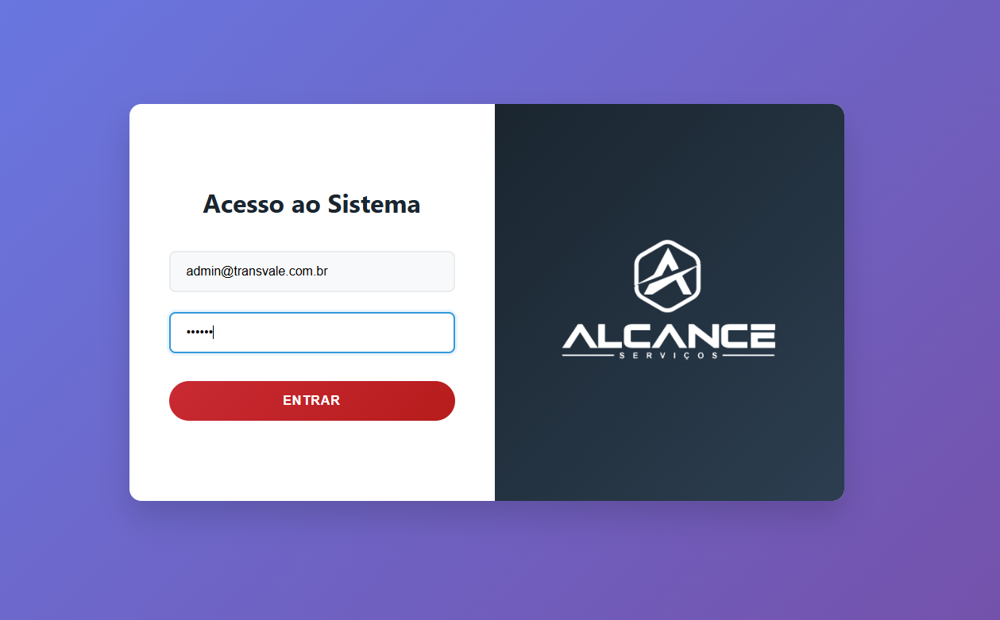

# 🚚 Gestão de Frotas & Consulta de Motoristas

> Um sistema corporativo focado em segurança logística, permitindo a gestão de empresas de transporte e a consulta em tempo real da situação operacional de motoristas.

## 📄 Sobre o Projeto

Este projeto foi desenvolvido para atuar como uma camada de segurança e auditoria para operações logísticas. O sistema permite o cadastro de empresas parceiras e a validação do status de motoristas através de integrações com bases de dados de risco, garantindo que apenas profissionais habilitados realizem viagens.

O foco técnico desta aplicação está na **rastreabilidade** e **inteligência de dados**, mantendo um log rigoroso de acessos e exibindo métricas de avaliação de forma dinâmica.

### 🎯 Principais Funcionalidades

* **🚦 Consulta de Motoristas (Validação de Risco):**
    * Retorno visual imediato baseado no código de situação (`situationCode`) do profissional:
        * 🟢 **Verde - Liberado:** O motorista possui viagens liberadas e está apto.
        * 🟡 **Amarelo - Administrativo:** Avisos ou pendências leves.
        * 🔴 **Vermelho - Impedimento:** Bloqueio operacional crítico.
* **🏢 Cadastro e Gestão de Empresas:**
    * Onboarding de novas transportadoras e parceiros logísticos no ecossistema da plataforma.
* **🛡️ Auditoria e Logs de Segurança:**
    * Tabela de rastreamento de ações registrando Data/Hora, Usuário, Tipo, Ação e endereço IP.
    * Interface com paginação dinâmica e seletor de quantidade de registros (10, 20, 50 ou 100 por página).
* **📈 Analytics e Avaliações:**
    * Dashboards gerados via `Chart.js` para visualização de avaliações de serviço em escala percentual (0 a 100%).

## 🛠️ Stack Tecnológica

* **Frontend:** HTML5, CSS3, e ícones FontAwesome para identificação visual rápida em tabelas e status.
* **Processamento e Gráficos:** JavaScript Vanilla e `Chart.js` para renderização de dados analíticos.
* **Integração:** Consumo de APIs para validação de regras de negócio (status do motorista).

---

## 📸 Galeria do Sistema

| Autenticação Segura | Gestão de Transportadoras |
|:---:|:---:|
|  |  |
| *Controle de acesso rigoroso para operadores do sistema.* | *Módulo de cadastro de empresas e parceiros logísticos.* |

| Validação Operacional | Dashboard e Auditoria |
|:---:|:---:|
|  |  |
| *Consulta de status de risco do motorista em tempo real.* | *Painel analítico e tabela de logs com rastreamento de IP.* |

---
**Nota Técnica:** Este é um repositório de portfólio. O código-fonte integral não está exposto publicamente por conter regras de negócio sensíveis e integrações proprietárias de segurança.
