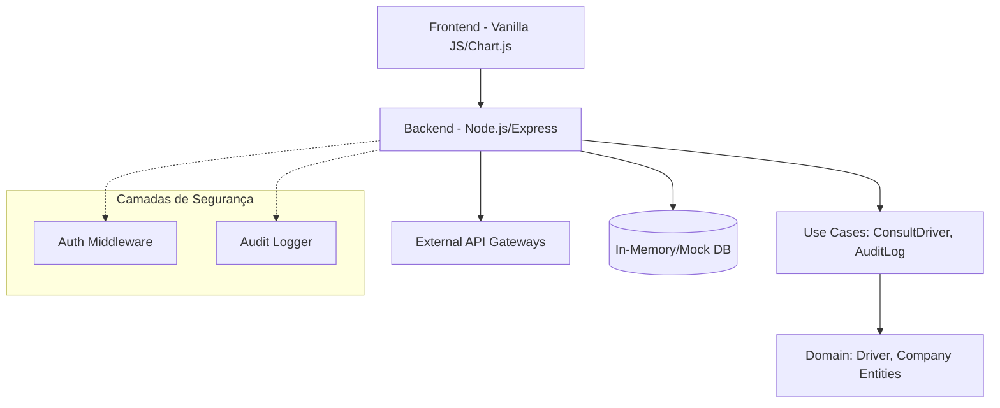
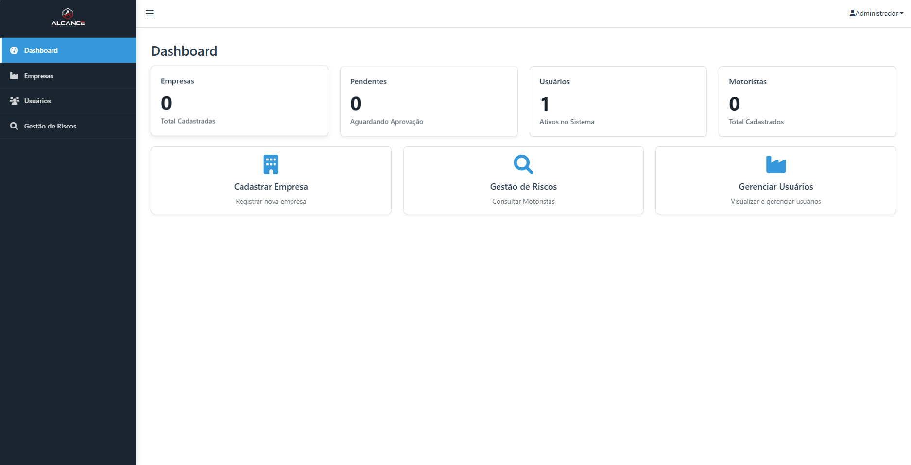
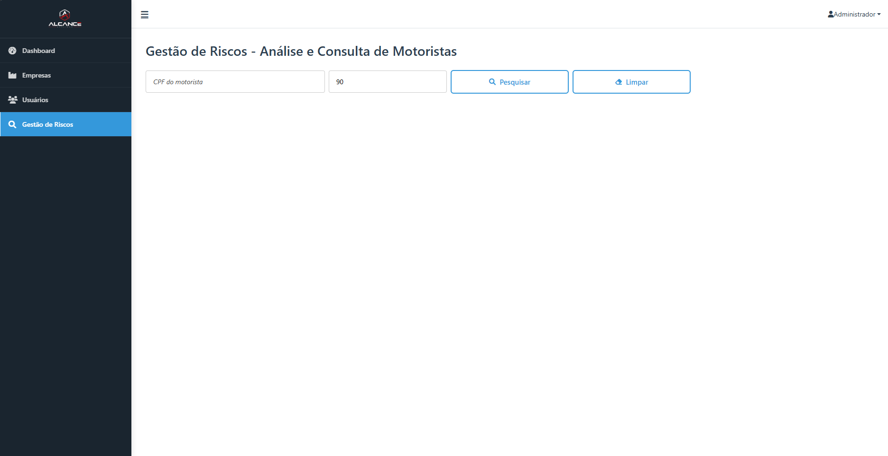
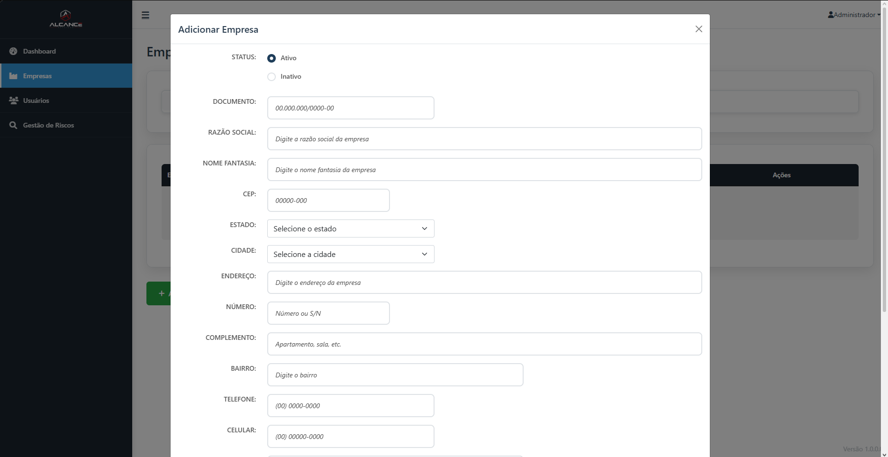
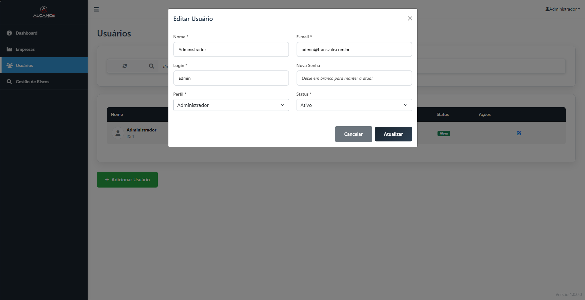

# 🚚 Gestão de Frotas & Consulta de Motoristas

> Um sistema corporativo robusto focado em segurança logística e auditoria, permitindo a gestão de empresas de transporte e a validação em tempo real da situação operacional de motoristas.

---

## 🎯 Objetivo e Problema

**O Problema:** Empresas de logística enfrentam riscos constantes ao contratar motoristas sem validação prévia. A falta de rastreabilidade e de um sistema centralizado para consulta de risco pode levar a sinistros, atrasos e falhas graves de segurança.

**A Solução:** Esta plataforma atua como um **Hub de Segurança Logística**. Ela centraliza o onboarding de transportadoras e oferece uma interface rápida para consulta de motoristas, integrando dados de diversas fontes para retornar um status de risco claro e acionável.

---

## 🏗️ Arquitetura do Sistema

O sistema segue princípios de **Clean Architecture** para garantir manutenibilidade e escalabilidade, separando regras de negócio de detalhes de infraestrutura.



---

## 🚀 Como Executar

### 🛠️ Ambiente de Desenvolvimento
Para rodar o projeto localmente para desenvolvimento:

```bash
# 1. Clone o repositório
git clone https://github.com/seu-usuario/gestao-de-frotas.git

# 2. Instale as dependências
npm install

# 3. Inicie o servidor em modo watch
npm run dev
```

---

### Exemplo de Request: Consulta de Motorista
`GET /api/v1/drivers/consult/{cpf}`

**Response (200 OK):**
```json
{
  "id": "12345678900",
  "name": "João Silva",
  "situationCode": "GREEN",
  "message": "Liberado para viagem",
  "lastUpdate": "2024-02-26T12:00:00Z"
}
```

---

## 🧪 Testes e Qualidade

Qualidade de código é prioridade. O projeto conta com testes automatizados cobrindo as principais regras de negócio.

*   **Testes Unitários (Jest):** Validação de entidades e casos de uso.
*   **Linting (ESLint):** Garantia de padrões de código consistentes.
*   **GitHub Actions:** Pipeline de CI configurado para rodar build, testes e lint a cada Pull Request.

---

## 📸 Galeria do Sistema

| Dashboard Geral | Validação de Risco |
|:---:|:---:|
|  |  |
| *Visão consolidada de métricas e performance.* | *Interface de consulta imediata de status.* |

| Gestão de Transportadoras | Auditoria e Logs |
|:---:|:---:|
|  |  |
| *Fluxo de onboarding de novos parceiros.* | *Rastreabilidade total via logs detalhados.* |

---

> [!NOTE]  
> **Nota Técnica:** Este é um repositório de portfólio. O código-fonte integral não está exposto publicamente por conter regras de negócio sensíveis e tokens de integração proprietários de segurança. No entanto, a estrutura e arquitetura aqui documentadas refletem com precisão a engenharia aplicada no sistema original.

